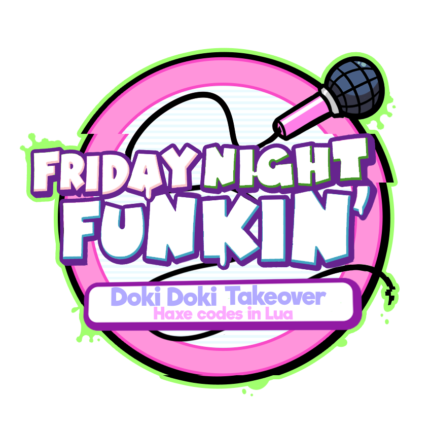

# Doki Doki Takeover - Haxe Codes In Lua 

**A collection of ready-to-use Lua scripts for Friday Night Funkin' modding (Psych Engine 0.7.3).**  
No Haxe knowledge required — just drag, drop, and customize.

---

## 📦 Included Scripts

| Script | Description |
|--------|-------------|
| **Meta Info UI** | Displays song name, artist, and custom icon with smooth entrance/exit animations. |
| **Custom Pause UI** | Fully animated pause menu (Resume/Restart/Exit) with optional per-song Pause Art. |
| **Custom Note Splash** | Customizable note splash effects (colors, sprites, timing). |
| **Custom Ratings** | Expands rating system (SS, SSS, etc.) with custom thresholds. |
| **Winning Icons** | Changes health bar icons to `_win` version when player/opponent is about to win. |
| **Custom Game Over** | Per-character Game Over sprites and sounds (using JSON characters). |

---

## 🚀 Installation

1. **Download** the latest `DDTO_Haxe_Codes_In_Lua.zip` from [Releases](https://github.com/NexusTeam-OFC/DDTO-Haxe-Codes-In-Lua).
2. **Extract** the folder into your mod's root directory (usually `mods/YourMod/`).
3. **Copy** desired `.lua` scripts into `mods/scripts/` or into individual song folders.
4. **Edit** the configuration tables at the top of each script (e.g., `meta` table, `pauseArtMapping`, `gameOverConfig`).
5. **Add assets** (icons, pause art, sounds) following the README inside each script's folder.

---

## 📖 Documentation

Each script comes with a detailed `README.txt` explaining:

- How to install and configure
- Asset folder structure
- Adding new entries (comma rules, examples)
- Troubleshooting common issues

Open the `Intructions/` folder inside the package.

---

## 🛠 Requirements

- **Friday Night Funkin'** with **Psych Engine 0.7.3** (or 0.6.3)
- Basic knowledge of Lua (copy/paste + edit values is enough)

---

## 👥 Credits

| Script | Original Author |
|--------|-----------------|
| Meta Info UI | Nexus Team |
| Custom Pause UI + Art | Nexus Team + Ansfoxy |
| Custom Note Splash | Nexus Team (adapted) |
| Custom Ratings | Nexus Team |
| Winning Icons | Nexus Team |
| Custom Game Over | Nexus Team |

> Some scripts are based on community solutions and adapted for Psych Engine 0.7.3.

---

## 📝 License

This project is licensed under the **Apache License** – you are free to use, modify, and distribute these scripts in your own mods, as long as credit is given to the original authors.

---

## 🤝 Contributing

Found a bug? Have a suggestion?  
Open an [Issue](https://github.com/your-username/DDTO-Haxe-Codes-In-Lua/issues) or submit a comment explaining the bug [GameBanana](https://gamebanana.com/mods/599360)

---

## ❤️ Support

If you find this package useful, consider:
- ⭐ Starring the repository
- 📢 Sharing with the FNF modding community

---

**Made with love by Nexus Team**
